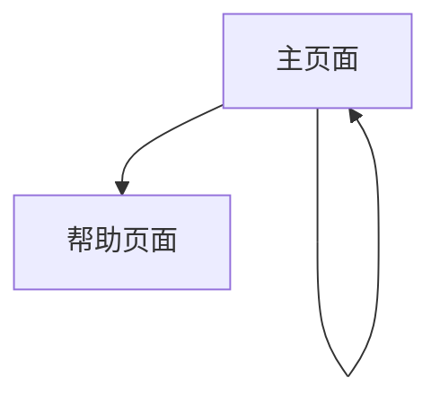

# 图片水印工具产品需求文档

## 1. 产品概述

一款专注于图片水印添加与编辑体验的轻量级 Web 工具，提供直观的水印自定义功能和治愈感的用户界面。

用户可以轻松上传图片，自定义水印文字的各种属性，支持实时预览和一键导出，完全前端实现无需后端服务。

目标打造既实用又极具治愈感的视觉保护工具，为用户提供舒缓、疗愈的操作体验。

## 2. 核心功能

### 2.1 功能模块

我们的图片水印工具包含以下主要页面：

1. **主页面**：图片上传区域、水印编辑面板、实时预览画布、导出功能
2. **帮助页面**：使用指南、功能介绍、常见问题

### 2.2 页面详情

| 页面名称 | 模块名称 | 功能描述 |
|---------|---------|----------|
| 主页面 | 图片上传区域 | 支持拖拽上传、点击选择文件，自动加载示例图片 |
| 主页面 | 水印编辑面板 | 文字输入、字体选择、颜色调节、透明度控制、大小缩放、旋转角度设置 |
| 主页面 | 位置控制面板 | 九宫格快速定位、自由拖拽移动、精确坐标调节 |
| 主页面 | 实时预览画布 | 显示添加水印后的效果、支持缩放查看、水印拖拽调整 |
| 主页面 | 导出功能 | 一键下载带水印图片、格式选择（PNG/JPG）、质量设置 |
| 帮助页面 | 使用指南 | 功能介绍、操作步骤说明、最佳实践建议 |
| 帮助页面 | 示例展示 | 水印效果案例、创意应用场景 |

## 3. 核心流程

用户首次进入工具时，会看到预加载的示例图片和预设水印，可以立即体验各项功能。用户可以上传自己的图片，然后在编辑面板中调整水印文字、字体、颜色、透明度等属性，通过九宫格或拖拽方式调整水印位置，实时预览效果后一键导出最终图片。

## 4. 用户界面设计

### 4.1 设计风格

- **主色调**：奶白色 (#FEFEFE)、雾紫色 (#E6E0F8)、淡蓝色 (#E3F2FD)
- **辅助色**：柔和灰色 (#F5F5F5)、淡粉色 (#FCE4EC)
- **按钮样式**：圆角矩形，柔和阴影，果冻感质感
- **字体**：优雅的无衬线字体，主要文字 16px，标题 24px，说明文字 14px
- **布局风格**：卡片式设计，半透明面板，高斯模糊背景
- **图标风格**：线性图标，圆润风格，与整体治愈感保持一致
- **动效**：使用 Framer Motion 实现柔和的渐变、缩放、滑动动画

### 4.2 页面设计概览

| 页面名称 | 模块名称 | UI 元素 |
|---------|---------|----------|
| 主页面 | 图片上传区域 | 虚线边框拖拽区域，柔和阴影，上传图标，提示文字使用淡蓝色 |
| 主页面 | 水印编辑面板 | 半透明白色背景，圆角卡片，滑块控件使用雾紫色，输入框柔和边框 |
| 主页面 | 位置控制面板 | 九宫格按钮采用果冻质感，激活状态使用淡蓝色高亮 |
| 主页面 | 实时预览画布 | 居中显示，柔和阴影边框，背景使用高斯模糊效果 |
| 主页面 | 导出功能 | 渐变背景按钮，悬停时轻微放大动效，成功状态显示绿色提示 |
| 帮助页面 | 使用指南 | 卡片式布局，步骤编号使用圆形背景，配色与主题保持一致 |

### 4.3 响应式设计

产品采用移动优先的响应式设计，在桌面端提供完整功能体验，在移动设备上优化触摸交互，确保在不同屏幕尺寸下都能提供良好的用户体验。